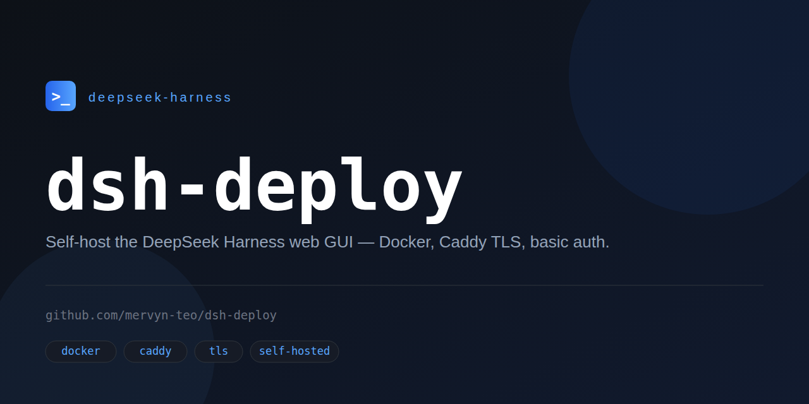

<p align="center">
  
</p>

# dsh-deploy

Deployable Docker image for the [DeepSeek Harness](https://github.com/deepseek-ai/deepseek-harness) Web GUI (`dsh web`), with TLS and authentication in front of it.

## Why the extra proxy?

`dsh web` **refuses to bind `0.0.0.0`** — the CLI exits with:

> `--host 0.0.0.0` is intentionally not supported yet for safety: it would expose remote code execution to the network

and DSH has **no built-in authentication**. So this image runs two processes:

```
Internet ──TLS──> Caddy (80/443, basic auth) ──> 127.0.0.1:3080 ──> dsh web
```

Caddy handles Let's Encrypt certificates automatically and gates everything behind HTTP basic auth. `dsh` stays on loopback and additionally gets your domain allowlisted via its `--trusted-host` browser-trust fence.

> ⚠️ **Anyone past the auth has a coding agent with shell access on the host.** Use a long random password, keep the image updated, and restrict the security group/firewall to 80+443.

## Quick start (local)

```bash
cp .env.example .env       # set DSH_AUTH_PASSWORD at minimum
docker compose up -d --build
# open http://localhost  (plain HTTP locally; TLS needs a real domain)
```

State (settings, profiles, sessions, provider config) persists in the `dsh-home` volume mounted at `/data` (`$DSH_HOME`).

## Seeded local setup

The image carries a `seed/` directory — a snapshot of a local DSH setup — that the entrypoint copies into `/data` on **first boot only** (marker: `/data/.seeded`):

- `seed/settings.yaml` — provider config (`kimi-coding`) and the default model (`kimi-coding` / `k3`)
- `seed/skills/` — agent skills (e.g. `publishing-dsh-plugins`)
- `seed/profiles/web/` — the web profile: `package.json` listing all GUI plugins (dshmarket, terminal, rag, qr-connect, frieren, background, quick-actions, collapsible-steps, llm-balance, modlens, open-in-vscode) plus `cordis.patch.yml` with profile-level config. On first boot the entrypoint runs `pnpm install` there (pnpm is what `dsh plugin install` uses; its peer handling tolerates the plugins' rc.6 peer ranges where npm hard-fails with ERESOLVE), so plugins come from npm/GitHub — no local `file:` paths.
- **Credentials are *not* in the image.** The entrypoint writes `/data/.credentials.yaml` from the `*_API_KEY` env vars on first boot, so keys travel via `.env` (gitignored) only.

To re-seed an existing deployment: `docker compose down`, `docker volume rm dsh-deploy_dsh-home` (⚠️ deletes chat sessions too), `docker compose up -d --build`. To change the setup later, edit files under `/data` directly (`docker compose exec dsh bash`) — the seed never overwrites live state.

## Deploy to AWS (one click)

[](https://console.aws.amazon.com/cloudformation/home#/stacks/create/review?templateURL=https://raw.githubusercontent.com/mervyn-teo/dsh-deploy/main/template.yaml&stackName=dsh-deploy)

> The button downloads `template.yaml` from this repo, and the instance clones the repo at boot — both URLs must stay publicly fetchable, so keep the repo public (or adjust the URLs if you fork it private).

The button opens the CloudFormation console with [`template.yaml`](template.yaml) preloaded. Fill in the form — auth password (required, min 12 chars), domain (optional; empty = plain HTTP on the Elastic IP), API key (optional) — then **Create stack**. About 5 minutes later the stack outputs the GUI URL. The stack includes:

- a `t4g.micro` (ARM, ~$6/mo while running) with 16 GB gp3, IMDSv2, and 1 GB swap for npm-heavy builds
- a security group opening only 80/443 (+ SSH only if you pick a key pair)
- an **Elastic IP** — point your DNS A record at it; it survives stop/start
- a user-data bootstrap: Docker + compose plugin, repo clone, `.env` from your parameters, `docker compose up -d --build` (watch `/var/log/cloud-init-output.log` on the instance if the URL isn't up yet)

**Usage-based billing:** unlike the fixed-price platforms, you can *Stop* the instance when idle and pay storage-only (~$1.30/mo for disk + idle EIP). *Start* it again and the stack picks up where it left off — DSH state lives in a Docker volume on the root disk.

## Deploy to a cloud VM (manual)

1. Launch a small Linux instance (Lightsail $3.50 plan or `t4g.micro` works; 1 GB RAM recommended). Open ports **80** and **443**; restrict SSH to your IP.
2. Point a DNS A record at the instance's static/elastic IP.
3. Install Docker + the compose plugin, clone this repo.
4. `cp .env.example .env` and set:
   - `DSH_DOMAIN=dsh.example.com` (your real hostname — required for TLS)
   - `DSH_AUTH_USER` / `DSH_AUTH_PASSWORD` (strong, unique)
   - `DEEPSEEK_API_KEY=sk-...` (or whichever env var your provider config references)
5. `docker compose up -d --build` — Caddy obtains a certificate on first request.

Teardown: `docker compose down` (add `-v` to also delete DSH state), then release the instance.

## Provider credentials

Providers are configured in `$DSH_HOME/settings.yaml` (`llm-pi-ai.providers`), each referencing an env var via `apiKeyEnv`. Pass the matching variables through `docker-compose.yml`'s `environment:` block. First run: open the GUI and configure the provider there, or edit `settings.yaml` inside the volume with `docker compose exec dsh bash` (file lives at `/data/settings.yaml`).

## Configuration reference

| Env var | Default | Purpose |
|---|---|---|
| `DSH_DOMAIN` | `:80` | Public hostname. `:80` = plain HTTP local testing. A real hostname enables auto-HTTPS + `--trusted-host`. |
| `DSH_AUTH_USER` | `admin` | Basic-auth username. |
| `DSH_AUTH_PASSWORD` | *(unset)* | Basic-auth password, bcrypt-hashed at boot. **Unset = no auth — local testing only.** |
| `DSH_TRUSTED_HOST` | *(unset)* | Extra Host authority for dsh's trust fence (e.g. a bare public IP for plain-HTTP access). A real `DSH_DOMAIN` is allowlisted automatically. |
| `DEEPSEEK_API_KEY` | *(unset)* | Provider key, consumed via `apiKeyEnv` in `settings.yaml`; written to `/data/.credentials.yaml` on first boot. |
| `KIMI_CODING_API_KEY` | *(unset)* | Same, for the seeded `kimi-coding` provider. |
| `DSH_VERSION` (build arg) | `0.1.0-rc.7` | Pinned `@deepseek-ai/dsh` npm version: `docker build --build-arg DSH_VERSION=... .` |

## Notes & limitations

- `dsh web` runs as the unprivileged `dsh` user; Caddy runs as root to bind 80/443 (drop-in hardening: move Caddy to high ports + host port mapping if your threat model disallows root).
- **Loopback-only settings are deliberately unlocked.** dsh gates settings/credentials to loopback twice — a Host-header fence server-side and an `isLoopback` check on the page origin client-side (without both, Settings → Models errors with "settings are unavailable in this browser" and Settings → Plugins renders empty). The entrypoint rewrites `Host`/`Origin` to loopback at the proxy, and the Dockerfile patches the served client bundle to treat every origin as loopback. The security boundary is therefore entirely Caddy's basic auth — justified because anyone past auth can already run arbitrary shell commands through the agent. `Sec-Fetch-Site` is not rewritten, so cross-site (CSRF/DNS-rebinding) requests are still rejected.
- Smoke-tested locally with plain HTTP (`DSH_DOMAIN=:80`) and end-to-end on AWS (t4g instance, real domain, Let's Encrypt TLS): image builds, container reports healthy, auth returns 401 without/with wrong credentials and 200 with correct ones, dsh runs as the unprivileged `dsh` user, and the Models/Plugins settings pages work through the proxy.
- Memory: comfortable at 1 GB; 512 MB instances may OOM under load.
- AWS Marketplace path: once this stabilizes, the same image can be baked into an AMI with a first-boot script for an AMI product listing. Seller registration + AWS security review apply — see AWS's Marketplace seller guide before investing there.

## License

MIT
